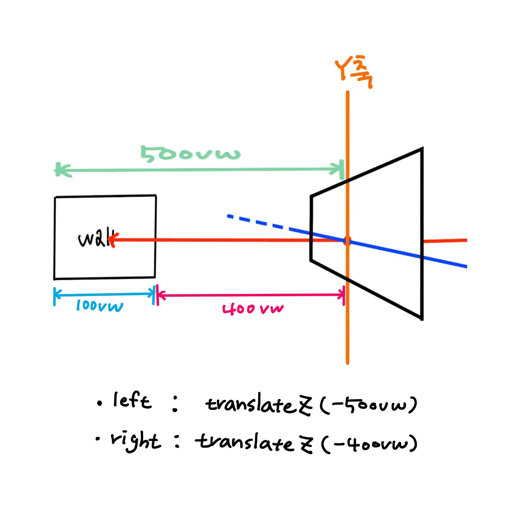

# 미니프로젝트

## 프로젝트 기능
1. 3D공간 만들기(css)
2. 스크롤 이벤트 - 3D 공간감 나타내기
3. 프로그래스바 만들기
4. 마우스 이벤트 - 3D 공간 시점 움직이기
5. 캐릭터 동적 생성
6. 캐릭터 조합
7. 키보드 조작 - 캐릭터와 공간 조작
8. 클릭 이벤트 - 공간의 색상변화와 캐릭터 바꾸기

## 1. 3D공간 만들기 (CSS)
### 1) 공간 자체를 3D로 만들기

```css
.world{
    position: fixed;
    left: 0;
    top: 0;
    width: 100vw;
    height: 100vh;
    perspective: 1000px;
}
```
.word에 perspecive를 사용하고, position을 fixed로 설정(이렇게 하면 스크롤이 위아래로 움직이지 않는다.)하고 width와 height를 화면꽉차게 한다.

```css
.stage{
    position: absolute;
    left: 0;
    top: 0;
    width: 100vw;
    height: 100vh;
    transform-style: preserve-3d;
}
```
`transform-style: preserve-3d;` 는 `.word`에서 설정한 3D효과를 잘 전달하기 
위해서 설정해 두었다.
 EI는 지원이 안됨/웹킷 기반 브라우저에 지원된다.(크롬, 모바일기반, 사파리 등)

 <br>


 ### 2) 공간의 옆벽 만들기


 ```css
.wall-left{
    left: -500vw;
    width: 1000vw;
    background: #f8f8f8;
    transform: rotateY(90deg);
}
```
`transform: rotateY(90deg);`하면 센터를 중심으로 돌아갔다.
옆으로 옮겨줘야 하는 `.wall-left`의 width의 반 길이 만큼 옆으로 옮겨져야 `.wall`의 옆에 붙어서 표현된다.

#### 그럼? right는???

```css
.wall-right{
    left: -500vw;
    width: 1000vw;
    background: #f8f8f8;
    transform: rotateY(90deg) translateZ(100vw);
    /* translateZ로 움직인 이유는 y축으로90도로 돌렸기 때문에 x축이 아니라 z축쪽으로 움직이고 wall의 너비 만큼만 움직여줘야 하기 때문에 wall의 너비 100vw만큼 움직여 주면 된다. */
}
```
다른 방법으로는 



```css
.wall-left{
    width: 1000vw;
    background: #f8f8f8;
    transform: rotateY(90deg) translateZ(-500vw);
}
.wall-right{
    width: 1000vw;
    background: #f8f8f8;
    transform: rotateY(90deg) translateZ(-400vw);
}
```
이 방법은 left를 사용하지 않고 translateZ를 이용해 이동한 것으로 y축으로 rotate한 상태에서 z축 -(마이너스)방향으로 left는 500vw(자신의 너비의 반)/ right는 -400vw(500vw-100vw(wall의 너비)의 값)을 이동하면 된다.

 <br>
 <br>

### 3) 콘텐츠 벽에 공간감 주기
```css
.wall-front-a{transform: translateZ(300vw);}
.wall-front-b{transform: translateZ(50vw);}
.wall-front-c{transform: translateZ(-200vw);}
.wall-front-d{transform: translateZ(-500vw);}
/* translateZ에 490vw로 하면 화면 꽉차게 나온다. */
```

---
 <br>
 <br>
 <br>

## 2. 스크롤 이벤트 - 3D 공간감 나타내기
### 1) 스크롤 할 수 있는 범위 구하기


```javascript
const houseElem = document.querySelector('.house');
let maxScrollValue =document.body.offsetHeight - window.innerHeight;
//전체 스크롤 할 수 있는 범위

window.addEventListener('scroll', function(){
    const zMove = pageYOffset/maxScrollValue * 970 -490;
});
```

`pageYOffset / maxScrollValue ` : 스크롤한 비율을 0에서 1로 나타내게 한다.
+ `pageYOffset` : 웹 문서가 수직으로 얼마나 스크롤 되었는지 px단위로 반환하는 속성 - window scroll 이벤트와 함께 실시간 스크롤 진행 여부를 체크한다.

### 2) 창 사이즈 변경 할때의 대응
:star: :star: :star: :star:<br>
**많이 사용하니까 중요하다.**

>창 사이즈가 변경 될때(사이즈를 줄임) 화면이 의도한 대로 마지막까지 보여지지 않는 에러가 발생한다.
F5를 눌러야 변경된 사이즈의 창으로 변경되어 에러가 나오지 않는다.

창 사이즈가 변경될떄에 maxScrollValue도 변경이 되는데 그 값을 갱신해 줘야 한다. F5를 누르지 않고 이런 에러를 대응 할 수 있다. 
이떄 사용하는 것을 `resize이벤트`

```javascript
function resizeHandler(){
    maxScrollValue =document.body.offsetHeight - window.innerHeight;
}

window.addEventListner('resize', resizeHandler);
resizeHandler();
```
창 사이즈가 변경 될떄마다 maxScrollValue의 값이 변경될 것이고 그 값을 사용하는 `zMove`변수의 값이 갱신이 되면서 창 사이즈에 따라 스크롤의 비율을 갱신하게 된다.

이렇게 되면 창 사이즈가 변경되어도 대응할 수 있게 된다.

#### 마지막에 resizeHandler() 함수를 호출한 이유는
> 창이 실행되자마자 resizeHandler()함수를 호출해 초기값을 갱신하기 위함이다.

---

<br>
<br>
<br>

## 3. 프로그래스바 만들기
스크롤을 할때마다 프로그래스바를 그 비율만큼 퍼센트를 Width를 변경해주면 된다.
1. 프로그래스바 엘리먼트를 잡아낸다.
```javascript
const barElem = document.querySelector('progress-bar');
```
2. 스크롤 이벤트 안에 프로그래스바의 css를 조정해준다.
이때 스크롤의 비율의 값의 퍼센트값을 너비의 값으로 넣어주었기 때문에
사용하는 `pageYOffset/maxScrollValue`의 식이랑 같다. 

```javascript
window.addEventListener('scroll', function(){
    const zMove = pageYOffset/maxScrollValue * 970 -490;

    //progress bar
    barElem.style.width = pageYOffset/maxScrollValue * 100 + '%';
});
```

따라서 `pageYOffset/maxScrollValue`값을 변수로 넣어서 재상용 할 수 있게 만들어준다.
```javascript
window.addEventListener('scroll', function(){
    const scrollPer = pageYOffset/maxScrollValue;
    const zMove = scrollPer * 970 -490;

    //progress bar
    barElem.style.width = scrollPer * 100 + '%';
});
```
---
<br>
<br>
<br>


## 4. 마우스 이벤트 - 3D 공간 시점 움직이기
### mousemove 이벤트사용하기
이벤트 핸들러를 사용할떄 e(이벤트 객체)를 매개변수 자리에 넣고 그 값을 받아 올 수 있다.<br>
이벤트 객체 속성 중에  `clientx`, `clienty`값을 이용한다.
마우스를 움직일떄 마다 그 마우스의 x,y좌표를 볼 수 있다.

>`clientx`, `clienty` 를이용하여 마우스의 현재 위치를 px단위로 알 수 있다.
+ 이 값을 계산해서 우리가 쓰기 좋은 형태로 만들어줘야 한다.
+ 이 속성은 화면의 왼쪽 위의 값이 0에 수렴한다.
+ 우리가 원하는 효과는 마우스가 가운데에 있을때 회전이 안되어 있는 즉, 기준으로 위, 아래, 좌우가 균일하게 움직이길 원한다.


+ 하지만 cilentx, clinety값을 그대로 쓰기면 가운데에 마우스가 있을때 회전이 된 상태이고 회전각을 계산하기에 어려움이 있다.
+ 따라서 가운데의 값(0)를 기준으로 마이너스(-1), 플러스(+1)값을 이용해서 해서 많든다.
```javascript
window.addEventListener('mousemove', function(e){
    const mousePos = {x : 0, y:0};
    //마우스 움직이는 포인트로 세팅하려고 한다.
    //가운데를 0으로 한 값을 각도를 구해 사용할 것이다.

    mousePos.x = -1 +(e.clientX/this.window.innerWidth) * 2;
    mousePos.y = 1 - (e.clientY/this.window.innerHeight)*2;
});
 
```
이 식을 통해 가운데가 원점(0)으로 만들 수 있다.!!!!!!
이 값에서 적절한 값을 곱해 원하는 값을 만들 수 있다.
+ <u>아주 많이 사용하는 식임으로 기억해두는 것이 좋다.</u>
+ 설명 : `e.clientX/this.window.innerWidth`은 현재 모니터에 마우스의 현재 위치를 0에서 1사이의 값의 비율을 나타낸다. 
+ `mousePos.x = -1 +(e.clientX/this.window.innerWidth) * 2;`는 잘 계산해 보면 가운데가 0이고 왼쪽이 -1 값을 갖고, 오른쪽이 +1값을 갖는 비율읠 계산해준다.
+ `mousePos.y`의 계산식도 이와 같은 계산식으로 가운데가 0, 위가 +1, 아래가 -1을 갖는 비율로 계산된다.

#### 어디에 적용해야 할까???
캐릭터도 추가할 예정임으로 벽으르 포함하고 있는 `house`와 캐릭터를 포함하고 있는 컨테이너인 `stage`를 회전 시켜 적용시켜준다.
```javascript
const stageElem = document.querySelector('.stage');
//스테이지 엘리먼트를 가져온다.
window.addEventListener('mousemove', function(e){
    const mousePos = {x : 0, y:0};
    //마우스 움직이는 포인트로 세팅하려고 한다.
    //가운데를 0으로 한 값을 각도를 구해 사용할 것이다.

    mousePos.x = -1 +(e.clientX/this.window.innerWidth) * 2;
    mousePos.y = 1 - (e.clientY/this.window.innerHeight)*2;

    stageElem.style.transform = 'rotateX(' + 0 + 'deg) rotateY(' + 0 +'deg)';
    //스테이지의 css transform을 변경하도록 한다.
    //transform속성을 두개 쓸때는 띄어쓰기 한다.
});

```
이때 `mousePos.x`값은 어디에 넣어야 할까? 
마우스가 좌우로 움직일때 stage의 움직임의 축은 Y축이고
마우스가 위,아래로 움직일때는 stage의 움직임의 축이 X축이다.
그래서 위에 구해낸 `mousePos.x`값은 `rotateY값`에  `mousePos.y`값은 `rotateX값`에 넣어준다.
```javascript
stageElem.style.transform = 'rotateX(' + mousePos.x + 'deg) rotateY(' + mousePos.y +'deg)';
```
이때, 범위가 -1에서 1의 값 사이기 때문에 곱하기(*)를 이용해 값을 좀더 크게 조절할 수 있다.
```javascript
        stageElem.style.transform = 'rotateX(' + (mousePos.y * 5) + 'deg) rotateY(' + (mousePos.x * 5) +'deg)';
```
---
<br>
<br>
<br>

## 4. 3D 캐릭터 구현 
각 부위별로 잘라서 이미지로 만든다.<br>
css파트에 카드 만들기를 참고하자.
### HTML
이 부분은 자바스크립트로 클릭했을때 동적 생성을 하기 떄문에 html파일에 직접 작성하지 않는다.
```html
<div class="character">
            <div class="character-face-con character-head">
                <div class="character-face character-head-face face-front"></div>
                <div class="character-face character-head-face face-back"></div>
            </div>
            <div class="character-face-con character-torso">
                <div class="character-face character-torso-face face-front"></div>
                <div class="character-face character-torso-face face-back"></div>
            </div>
            <div class="character-face-con character-arm character-arm-right">
                <div class="character-face character-arm-face face-front"></div>
                <div class="character-face character-arm-face face-back"></div>
            </div>
            <div class="character-face-con character-arm character-arm-left">
                <div class="character-face character-head-face face-front"></div>
                <div class="character-face character-head-face face-back"></div>
            </div>
            <div class="character-face-con character-leg character-leg-right">
                <div class="character-face character-head-face face-front"></div>
                <div class="character-face character-head-face face-back"></div>
            </div>
            <div class="character-face-con character-leg character-leg-left">
                <div class="character-face character-head-face face-front"></div>
                <div class="character-face character-head-face face-back"></div>
            </div>

        </div>
```
각 부위 파트마다 앞, 뒤가 있고 그 것을 그룹해주는 div로 묶어주는 형태의 html구조이다.
+ `character-face-con` : character-face를 감싸고 있는 container라는 뜻
+ `character-face` : 캐릭터의 면(face)을 의미
+ `face-front` : 앞면을 의미
+ `face-back` : 뒷면을 의미

### CSS
```css
.character {
    position: absolute;
    left: 12%;
    bottom: 5%;
    width: 10vw;
    height: 15.58vw;
    /* 여기서는 가로 : 세로의 비율을 픽스하기 위해서 vw로 높이 단위로 했다. */
    transform-style: preserve-3d;
    /* 상위 엘리먼트의 3d효과가 하위에도 적용되기 위해서 사용하는 것. */
}
```
+ `width와 height의 비율을 vw단위`로 맞춰서(뷰포트의 크기에 따라 크기를 다르게 하되, 비율을 그대로 가져가기 위해서 사용);

```css
.character[data-direction='forward'] { transform: rotateY(180deg); } /*앞모습*/
.character[data-direction='backward'] { transform: rotateY(0deg); } /*뒷모습*/
.character[data-direction='left'] { transform: rotateY(-90deg); } /*왼쪽*/
.character[data-direction='right'] { transform: rotateY(90deg); } /*오른쪽*/

```
 data-direction='forward'으로 바라보는 방향을 css로 설정해 놓은 것 
 상황에 맞춰서 [data-direction]값을 <u>방향을 결정</u>하는 것을 js로 지정하도록 미리 세팅한 값이다.

```css
.character-head {
    left: calc(42 / 856 * 100%);
    /* 이미지의 (left로 움직이고 싶은 길이/전체길이)의 비율을 퍼센트로 만들어서 넣어준 것*/
    top: 0;
    z-index: 60;
    width: calc(770 / 856 * 100%);
    /* (머리의 너비 / character 전체 길이)의 비율을 퍼센트로 만들었음 
    calc 함수인 경우 계산하지 않아도 수식으로 남길 수 있어서 수정하기 용이하다.*/
    /* 계산 값만 쓰게 된다면 수식을 주석으로 남겨 놓아 나중에 보기 좋게 해줘라. */
    height: calc(648 / 1334 * 100%);
    /* 놓이도 (머리 높이/character의 높이)의 비율을 calc함수고 계산 */
    transform-origin: center bottom;
    /* 이거 중요!!! transform의 기준의 center이라 목을 기준으로 움직이기 위해서 center bottom을 기준으로 설정했다. */
    animation: ani-head 0.6s infinite alternate cubic-bezier(0.46, 0.18, 0.66, 0.93);
}
```
+ `calc()` : calc(칼크)함수는 연산값이 숫자면 괜찮다.
+ 계산해서 숫자를 넣어도 되는데 연산의 식을 넣으므로서 나중에 이해 할 수 있다. 
+ `left: calc(42 / 856 * 100%);` : clac(옮기기 위한 수치/ 전체 그림 너비 값 * 100%); 

<br>

### CSS Animation
```css
@keyframes ani-head {
    to{transform: rotateX(-10deg);}
    /* 적용하는 엘리멘트에 animation : alternate를 널어주면 자연스럽다. */
}
@keyframes ani-running-leg {
    from{
        transform: rotateX(-30deg);
    }
    to{
        transform: rotateX(30deg);
    }
}
@keyframes ani-running-arm{
    from{
        transform: rotateY(-30deg);
    }
    to{
        transform: rotateY(30deg);
    }
}
```


### JS

#### 1. 생성자를 이용해 캐릭터를 만들기<bt>
character.js파일에 캐릭터 생성자 함수를 만들다.

```javascript   
    function Character(){
        this.mainElem = document.createElement('div');
        this.mainElem.classList.add('character');
        this.mainElem.innerHTML =`
        <div class="character-face-con character-head">
                <div class="character-face character-head-face face-front"></div>
                <div class="character-face character-head-face face-back"></div>
            </div>
            <div class="character-face-con character-torso">
                <div class="character-face character-torso-face face-front"></div>
                <div class="character-face character-torso-face face-back"></div>
            </div>
            <div class="character-face-con character-arm character-arm-right">
                <div class="character-face character-arm-face face-front"></div>
                <div class="character-face character-arm-face face-back"></div>
            </div>
            <div class="character-face-con character-arm character-arm-left">
                <div class="character-face character-head-face face-front"></div>
                <div class="character-face character-head-face face-back"></div>
            </div>
            <div class="character-face-con character-leg character-leg-right">
                <div class="character-face character-head-face face-front"></div>
                <div class="character-face character-head-face face-back"></div>
            </div>
            <div class="character-face-con character-leg character-leg-left">
                <div class="character-face character-head-face face-front"></div>
                <div class="character-face character-head-face face-back"></div>
            </div>`;

            document.querySelector('.stage').appendChild(this.mainElem);
    }
```
코드 해석

+ 생성자 함수이니까 식별자의 첫 글자는 대문자로 만들어준다.
+ <div>를 가지고 있는 `mainElem`을 만들고,  거기에 클래스 `.character`도 붙여준다. 
+ `mainElem`안에 캐릭터의 html구조 코드를 넣어준다.
+ 이 것을 appendChild를 이용해 `stage`안 마지막 부분에 밀어 넣어준다.

#### 2) 생성자 함수의 인스턴스를 만들어 호출시켜준다.
생성자 함수 안에는 작성한 코드가 실행되는 코드가 없기 때문에 화면상에 나오지 않는다. 그래서 화면에 캐릭터를 나타나게 할려면 `인스턴스`를 통해 생성자함수가 만들어낸 캐릭터는 화면에 호출시킨다.
`new키워드`를 사용해서 생성자를 붙여논다.

```javascript
new Character();

```
이때 나타나는 캐릭터의 위치는 `left : 12%`자리에 나타나도록 .character에 css에서 설정해 놓아서 캐릭터의 위치는 고정으로 그 자리에 나타난다.

#### 3) 클릭한 곳에 캐릭터 생성하기

하지만, 클릭을 한 자리에 나타나도록 해야하기 떄문에
'click이벤트`와 e(이벤트 객체)의 속성인 `clientX`의 값을 사용한다.

```javascript
window.addEventListener('click',function(e){
    new Character();
})

```
전체너비에서 클릭한 위치의 비율의 퍼센트를 구해 .character의 left값을 넣어주면 클릭한 위치에 인스턴스가 생성될 수 있다.
```javascript
e.clientX/window.innerWidth *100
```
이 식을 바로 매개변수에 넣어주는 것이 아니라 인스턴스의 매개변수를 객체로 만들어서 넣어준다.
```javascript
window.addEventListener('click',function(e){
    new Character({
        xPos : e.clientX/window.innerWidth *100
    });
})
```
이렇게 만들면 생성자함수 Character(info)의 매개변수(info)의 값에 xPos의 값이 들어가게 된다. 이 info의 값을 사용해서 생성자 함수 Character안에서 새롭게 만들어지는 캐릭터를 둘러싼 엘리먼트인 `mainElem`의 left값으로 넣어주면 된다.

```javascript   
    function Character(info){
        this.mainElem = document.createElement('div');
        this.mainElem.classList.add('character');
        this.mainElem.innerHTML =`
        <div class="character-face-con character-head">
                ....
        </div>`;

        document.querySelector('.stage').appendChild(this.mainElem);

        this.mainElem.style.left = info.xPos + '%';
    }
```
`this.mainElem.style.left = info.xPos + '%';` : info가 객체이니까 객체 안의 xPos의 값을 가져오려고 `info.xPos`를 넣고 단위(%)를 넣어주었다.

<br>

#### 4. 스크롤 했을때 캐릭터 움직이게 하기

**4-1). 스크롤 일어날때 팔, 다리 움직이게 하기**
css에 runing클래스를 붙여 애니메이션 실행하기
```css
.character.running .character-leg-right { animation: ani-running-leg 0.2s alternate infinite linear; }
.character.running .character-leg-left { animation: ani-running-leg 0.2s alternate-reverse infinite linear; }
.character.running .character-arm { animation: ani-running-arm 0.2s alternate infinite linear; }

@keyframes ani-running-leg {
    from{
        transform: rotateX(-30deg);
    }
    to{
        transform: rotateX(30deg);
    }
}
@keyframes ani-running-arm{
    from{
        transform: rotateY(-30deg);
    }
    to{
        transform: rotateY(30deg);
    }
}

```
**4-2). 스크롤이 될때 runnig클래스 붙이기**
- 캐릭터 생성자에 객체를 가지도록 한다.
- 러닝클래스를 상황에 따라 넣고 빼고 하는 것은 동작인 메서드인데
인스턴스들이 공통으로 가지는 공통 메서드는 protptype객체로 생성한다.

참고)
>원래 존재하는 객체에 프로토타입을 추가하는 방법
>```javascript
 > Character.prototype.xxxx =function(){};
>```
>프로토타입을 재설정하는 방법( 프로토타입을 묶어서 정리하고자 할때는)
>```javascript
>Character.prototype = {
>    constructor :Character;
>    xxxxx : function(){};
>}
>```

```javascript
Character.prototype = {
    constructor : Character;
    init : function(){
        window.addEventListener('scroll',function(){
            this.mainElem.ClassList.add('running');
        })
    };

}

```
`init()`은 프로토타입의 초기값을 설정하는 함수이다.<br>
`init()`함수에 스크롤 이벤트를 넣어줘서 캐릭터가 생성된 다음에 스크롤이 일어나면 애니메이션 클래스가 붙어 애니메이션이 나오게 한다.
+ Character 생성자 함수 않아 `this.init()`으로 함수를 호출해준다.

그런데 이렇게 하면 Error가 나온다.<br>
그 이유는 스크롤 이벤트 안의 콜백 함수 실행 내용이 ` this.mainElem.ClassList.add('running');`인데 여기서 `this`는 전역객체(window)를 가리킨다.

왜 전역 객체를 가리킬까????<br>
그 이유는 this는 자신을 호출한 객체에 this를 바인딩하는데 코드에서 이벤트를 실행시키고 호출시킨 주체 객체는 window이기 때문에 this가 window가 된다.

어떻게 this를 생성자함수 Character를 가르키게 하는 방법은??<br>
Character를 가르키는 this를 변수에 할당해서 그 변수를 이용하면 된다.
```javascript
Character.prototype = {
    constructor : Character;
    console.log(this);  //Character

    const self = this;

    init : function(){
        window.addEventListener('scroll',function(){
            self.mainElem.ClassList.add('running');
        })
    };

}
```
`const self = this;`는 `Character`를 가르키기 때문에 `this.mainElem`을 `self.mainElem`을 사용한다.

**4-3) 스크롤이 멈추면 running클래스 제거해 움직임 멈추기**
```javascript
function Character(info){
    ....
    this.scrollState = false;
}
```
+ `this.scrollState = false;`는 스크롤이 되어 있는지 않되는지 체크하는 변수이다. (변수에 값을 넣지 않은면 자동으로 undefined가 되는데 이걸 사용해도 됨)

```javascript
Character.prototype = {
    constructor : Character;
    console.log(this);  //Character

    const self = this;

    init : function(){
        window.addEventListener('scroll',function(){
            clearTimeout(self.scrollState);

            if(!self.scrollState){
                self.mainElem.ClassList.add('running');
            }
            
            self.scrollState = setTimeOut(function(){
                self.scrollState = false;
                self.scrollState.classList.remove('running');
            },500);
        })
    };

}
```
+ if문의 조건인 `!self.scrollState`이 true값이여야 if문 {}블록의 실행문이 실행된다. 따라서 false가 !연산자를 만나 true가 되서 캐릭터에 움직이는 애니메이션을 가지고 있는 .running클래스가 추가 된다.

+ 하지만, if문의 실행은 스크롤이 될때마다 실행되기 떄문에 비효율적이다.

+ `setTimeOut()`이 실행되는 순간에 숫자를 리턴해준다. 그렇다면 if문에서의 조건이 (!숫자값)이니까 숫자값은 true를 갖는다. 따라서 if문의 조건은 (!true) 즉 false가 됨으로 if문이 실행되지 않는데, 0.5 동안(setTimeOut 안이 실행되기 전까지의 시간을 의미한다) 적용된다. 그러다가 0.5 후(setTimeOut안의 실행문이 실행되는 시간을 의미)에 `self.scrollState = false;`로 인해 false값을 가지고 있으니까, 그 순간부터 if문이 실행이 되서 애니메이션이 적용된다.<br>
-> 이렇게 하면 캐릭터가 스크롤을 멈추면 움직이지 않는다. 하지만, 부자연스럽게 움직이다.
이것은 `running`클래스가 스크롤할때마다 붙였졌다 지워졌다는 반복하기 때문에 부자연스럽게 움직이는 것이다.

+ `clearTimeout(self.scrollState);` : 스크롤하자마자 `setTimeOut()`을 실행하지 못하게 한다. scroll이벤트 앞에 위치한 이유는 스크롤을 연속으로 할때마다 `clearTimeOut`이 실행되면서 `setTimeOut()`이 0.5초 후에 실행되어야 하는데 실행되는 시간을 주지 않음으로서 실행문인 애니메이션 클래스(. running)를 제거하는 것을 막기 위함이다. <br>
따라서, 스크롤 하는 중에는 계속해서 클리어되서 setTimeOut()이 실행이 안되다가 스크롤이 멈춘 시점에 그제서야 마지막 setTimeOut이 0.5초 후에 실행이 되는 것이다.

> <u>이렇게 하면 계속적으로 반복되는 메카니즘을 효율적으로 딱 한번 실행하도록 한다.</u>

<br>

**4-4) 캐릭터 뒤통수 보이게 하기**

앞으로 가고 뒤로 가는 것을 어떻게 판별할까??<br>
우리가 사용하는 것은 스크롤이기때문에
스크롤 된 위치가 어디인지 판단해서 현재의 위치보다 작으면 스크롤을 내렸다고 판단 크면 스크롤을 올렸다고 판단했다고 코딩하면 된다.

+ `pageYOffset`을 이용한다.
pageYOffset값을 변수(`lastScrollTop` , `A`)에 저장하면 계속해서 업데이트가 되면서 마지막 스크롤 된 값을 얻을 수 있다.
  + A보다 작다 = 스크롤을 위로 올렸다 = 화면이 뒤로 빠구했다. = `캐릭터의 얼굴`이 보여야 한다.
  + A보다 크다 = 스크롤을 아래로 내렸다. = 화면이 앞으로 진행된다. = `캐릭터의 뒤통수`가 보여야 한다.
``` javascript
if(self.lastScrollTop > pageYOffset){
    //이전 스크롤 위치가 현재 스크롤 보다 크다 = 스크롤을 올림
    //back
    self.mainElem.setAttribute('data-direction', 'backward');
}else{
    //이전 스크롤 위치가 현재 스크롤 보다 작다 = 스크롤 내림
    //forward
    self.mainElem.setAttribute('data-direction', 'forward');
}

self.lastScrollTop = pageYOffset;
//마지막의 스크롤 값을 가져와야 하기때문에 아래에 값을 할당해 갱신해 준다.
```

#### 5. 캐릭터 키보드로 좌우로 움직이게 하기
5-1) **keydown 이벤트, keyup 이벤트**

css의[data-direction] 속성으로 설정해주었음
이떄는 스크롤이 아니라 키보드 이벤트를 이용해 css 속성을 변경해주면 된다.
키보드 바향키를 눌렀을때 캐릭터의 방향을 바꿔주도록 하겠다.
```javascript
window.addEventListner('keydown', function(e){
    console.log(e.keyCode);
});
```
+ 이벤트 keydown 속성 중에 keyCode속성이 있다. 키보드가 가지고 있는 고유의 값을 가지고 캐릭터를 제어해준다.<br>
※ 참고) [키보드 코드를 알려주는 웹사이트](keycode.info) 
  + 왼쪽 : 37
  + 오른쪽 : 39

```javascript
window.addEventListner('keydown', function(e){
    console.log(e.keyCode);
    if(e.keyCode == 37){
        //왼쪽 방향키
        self.mainElem.setAttribute('data-direction', 'left');
    }else if(e.keyCode == 39){
        //오른쪽 방향키
        self.mainElem.setAttribute('data-direction', 'right');
    }
});
```
이제는 방향키를 누르면 걸어가도록 만들어야 한다.<br>
걸어가는 동작을 넣어줄려면 `.running`이 있어야 한다.
```javascript
window.addEventListner('keydown', function(e){
    console.log(e.keyCode);
    if(e.keyCode == 37){
        //왼쪽 방향키
        self.mainElem.setAttribute('data-direction', 'left');
        self.mainElem.classList.add('running');
    }else if(e.keyCode == 39){
        //오른쪽 방향키
        self.mainElem.setAttribute('data-direction', 'right');
        self.mainElem.classList.add('running');
    }
});
```
이렇게 하면 방향키를 누리지 않아도 계속해서 걷는 애니메이션이 적용된다.
이럴때에는 runing클래스를 제거해야 한다.
```javascript
//키를 뗐을때 => keyup
window.addEventListener('keyup', function(e){
    self.mainElem.classList.remove('running');
});
```
다음은 좌우로 이동하는 것을 추가한다.<br>
속도를 가지도록 해야 한다. 스피드 속성을 세팅해준다.
```javascript
 function Character(info){
this.speed = 5;
 }

```
각 캐릭터의 위치를 결정해주는데 left이 결정해준다.
지금 캐릭터에서 left값을 결정해주는 것은 info의xPos값이다.<br>
이동하는것은 info의 xPos값을 갱신해서 left 값을 바꿔 위치를 움직이도록 한다.<br>
info의 xPos의 값을 `Character`의 속성 값으로 만들어서 접근도 하고 새로운 값을 갱신 할 수 있게 준비한다.
```javascript
 function Character(info){
this.speed = 0.3;
this.xPos = info.xPos;
 };
window.addEventListner('keydown', function(e){
    console.log(e.keyCode);
    if(e.keyCode == 37){
        //왼쪽 방향키
        self.mainElem.setAttribute('data-direction', 'left');
        self.mainElem.classList.add('running');
        self.xPos -= self.speed;
        // self.xPos =  self.xPos- self.speed;
        //스피드만큼 현재의 위치를 빼준다.
        self.mainElem.style.left = self.xPos + '%';
        
    }else if(e.keyCode == 39){
        //오른쪽 방향키
        self.mainElem.setAttribute('data-direction', 'right');
        self.mainElem.classList.add('running');
    }
});

```
스피드 값만큼 현재의 위치를 뺴주면 갱신된 값을 넣어준다.
```javascript
    self.mainElem.style.left = self.xPos + '%';
```
근데 버벅 거린다.
현재 keydown이벤트를 의존해서 값이 갱신되고 있는데 keydown이벤트는 자연스럽게 표현될 수 있을 정도로 많이 이벤트가 발생하지 않는다.(1초당 10프레임정도 발생한다.=> 버벅 거린다.)
영상(영화 24프레임정도)이니까 최소한의 그정의 프레임을 가지고 만들어야 한다.

5-2) **`requestAnimationFrame`을 활용.**

property안에 메서드로 추가한다.
그리고 방향을 알아보기 위해  생성자 Character함수에 this.direction 속성을 추가한다.
+ 방향키를 눌렀을때 direction이 left와 right가 될 수 있게 코드를 작성해준다.
```javascript
 function Character(info){
this.speed = 0.3;
this.xPos = info.xPos;
this.direction;
 };
window.addEventListner('keydown', function(e){
    console.log(e.keyCode);
    if(e.keyCode == 37){
        //왼쪽 방향키
        self.direction = 'left';
        self.mainElem.setAttribute('data-direction', 'left');
        self.mainElem.classList.add('running');
        // self.xPos -= self.speed;
        // self.xPos =  self.xPos- self.speed;
        //스피드만큼 현재의 위치를 빼준다.
        // self.mainElem.style.left = self.xPos + '%';
        
    }else if(e.keyCode == 39){
        //오른쪽 방향키
        self.direction = 'right';
        self.mainElem.setAttribute('data-direction', 'right');
        self.mainElem.classList.add('running');
    }
});
```
키보드 이벤트에 `self.direction`방향을 넣어주어 run메서드의 조건문에 조건식이 될 수 있도록 해준다.

```javascript
run : function(){
    const self = this;

    if(self.direction == 'left'){
        self.xPos -= self.speed;
    }else if(self.direction == 'right'){
        self.xPos += self.speed;
    };

    self.mainElem.style.left = self.xPos + '%';

    requestAnimationFrame(self.run);
}
```
run메서드에 `requestAnimationFrame`을 재귀 호출해서 반복하도록 하게 한다.
그리고 방향키를 눌렀을때 run 메서드가 호출될 수 있도록 한다.
```javascript
window.addEventListner('keydown', function(e){
    console.log(e.keyCode);
    if(e.keyCode == 37){
        //왼쪽 방향키
        self.direction = 'left';
        self.mainElem.setAttribute('data-direction', 'left');
        self.mainElem.classList.add('running');

        self.run();
        //메서드 호출
        
    }else if(e.keyCode == 39){
        //오른쪽 방향키
        self.direction = 'right';
        self.mainElem.setAttribute('data-direction', 'right');
        self.mainElem.classList.add('running');

        self.run();
        //메서드 호출
    }
});
```
이렇게 하면 에러가 난다.
자바스크립트의 함수는 호출하는 객체를 this로 받기 떄문에 지금 코드에서는 호출하고 있는 것은 self처음에는 self이지만, `requestAnimationFrame`을 통해 run함수가 다시 불려지면서 this는 `requestAnimationFrame`이 this가 되면서 전역 객체인 window가 this로 바인딩 되었다.

1. 함수의 매개변수로 전달해서 this를 살리는 방법
2. bind 메서드로 this를 직접 지정하기
> bind()는 호출방법과 관계없이 특정 this값으로 호출되는 함수를 만든다.
+ bind()의 첫번째 인자 값을 this값에 고정시켜 this값이 변하지 않도록 해준다.
```javascript
run : function(self){
        const self = this;
        ....
        ....
        self.rafId = requestAnimationFrame(self.run.bind(self));
        }
    }
```
그런데 극단적으로 빨라지고 사라진다.....


5-3) **좌우로 이동하는 것 (속도도 다르게 한다.)**
키를 여러번 누르면 `requestAnimationFrame`이 중첩으로 이용되서 속도가 가속된다.

이 문제를 없애기 위해서 키를 누르는 동안에 키를 누르는 함수가 여러분 호출되지 않도록 해줘야 한다.
그것을 위해 속성을 추가하나.
```javascript
//좌우 이동 중인지 아닌지 판별하는 속성
this.runningState = false;
```
즉 `runningStat`가 true라면 함수를 return(종료)시켜서 여러번 일어나지 않도록 한다.
```javascript
window.addEventListner('keydown', function(e){
    if(self.runningState) return;

    console.log('키다운');
    if(e.keyCode == 37){
        //왼쪽 방향키
        self.direction = 'left';
        self.mainElem.setAttribute('data-direction', 'left');
        self.mainElem.classList.add('running');

        self.run();
        //메서드 호출
        self.runningState = true;
        //이렇게 되면, 키 다운이벤트가 여러번 나타나지 않고 
        //한번만 실행되어 중첩되지 않아 속도가 빨라지지 않는다.
        
    }else if(e.keyCode == 39){
        //오른쪽 방향키
        self.direction = 'right';
        self.mainElem.setAttribute('data-direction', 'right');
        self.mainElem.classList.add('running');

        self.run();
        //메서드 호출
        self.runningState = true;
    }
});
```
방향키를 뗐는데도 캐릭터의 위치가 변화하기 떄문에
keyup 이벤트를 통해 움직잊 않도록 설정해준다.
  + 왜 애니메이션이나 방향은 한번만 실행하는데 그대로인가?
   <br>: 코드를 잘 살펴보면, 클래스를 제거하지도 않았고, 데이터 속성도 변경되지 않았기 때문에 그대로 진행되는 것이다. 여러번 중첩되어도 내용은 그대로이니 크게 변화가 없지만 `requestAnimationFrame`같은 경우에는 키를 누를 때무다 계속해서 호출되기 떄문에 애니메이션이 빠라지는 것이다.  

위치를 움직이지 않기 위해서 `requestAnimationFrame`을 취소하도록 하면 된다.
`requestAnimationFrame`는 숫자를 리턴하기 때문에 그것을 이용해서 `requestAnimationFrame`을 `cancelAnimationFram`을 이용해취소할 수 있다.

+ `requestAnimationFrame`이 리턴하는 값을 저장하는 변수를 만들어준다
```javascript
this.rafId;
```
그리고 `requestAnimationFrame(function(){self.run(self));});`를 값으로 저장해준다.
```javascript
self.rafId = requestAnimationFrame(function(){
            self.run(self);
```

```javascript
//키를 뗐을때 => keyup
window.addEventListener('keyup', function(e){
    self.mainElem.classList.remove('running');
    cancelAnimationFrame(self.rafId);
});
```
키를 떼고 다시 누르면 실행이 안된다.
다시 눌렀을때, `runningState`가 계속해서 `true`이기 때문에 키를 눌러도 keydown이벤트가 return되기 때문에 아래의 코드가 실행되지 않아서 동작하지 않게 되었다.<br>
따라서
```javascript
//키를 뗐을때 => keyup
window.addEventListener('keyup', function(e){
    self.mainElem.classList.remove('running');
    cancelAnimationFrame(self.rafId);
    self.runningState = false;
    //초기화 시켜준다.
});
```
그러면 다시 키보드를 누를때 잘 움직이다. 

그런데...
벽을 뚥고 나간다.
xPos값을 if문을 이용해 조절해준다.


다음은 좌우로 이동하는 것을 추가한다.<br>
속도를 가지도록 해야 한다. 스피드 속성을 세팅해준다.
```javascript
 function Character(info){
this.speed = 5;
 }

```


#### 6. 속도를 랜덤으로 만들기
처음에 생성할때 스피드를 랜덤하게 들어갈 수 있도록 한다.
this.speed의 값을 생성할떄 랜덤하게 한다.
```javascript
this.speed = info.speed;
```
로 지정하고,
stageElem의 클릭 이벤트를 할때 인스턴스가 만들어지도록 할떄 그떄 스피드를 각각 다른 값을 가진 인스턴스를 가지도록 생성자의 매개변수 객체에  speed를 넣어준다.

```javascript
  stageElem.addEventListener('click', function(e){
        console.log(e.clientX/window.innerWidth * 100);
        
        new Character({
            xPos : e.clientX/window.innerWidth * 100,
            speed : Math.random();
        });
```
+ random()은 0부터 1사이의 랜던한 값을 뿌려준다.
+ 속도를 제한하고 싶다면 `* 0.5 `을 해주고 여러 수식을 넣어서 조절해준다.


<br>

#### 7. 테마 & 캐릭터 바꾸기
css코드 중에 body [data-char = 'ragirl']의 body의 색상, ragirl일때의 character의 이미지 를 설정해 둔다.

캐릭터를 클릭했을때 클릭한 곳의 data-char의 값을 body의 attribute가 바뀔 수 있도록 한다.

```javascript
    const selectCharacterElem = document.querySelector('.select-character');

selectCharacterElem.addEventListener('click',function(e){
        const value = e.target.getAttribute('data-char');
        document.body.setAttribute('data-char', value);
        
    });
```
이렇게 하면 끝!ㅎ
